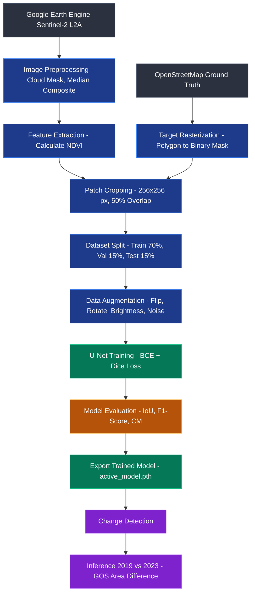

<div align="center">

# 🛰️ Green Open Space Revolution Monitoring
### U-Net Deep Learning on Sentinel-2 Satellite Imagery — DKI Jakarta

[](https://python.org)
[](https://pytorch.org)
[](https://streamlit.io)
[](LICENSE)

*Research on monitoring changes in Green Open Space (GOS) in Jakarta using U-Net based semantic segmentation on Sentinel-2 multispectral imagery.*

</div>

---

## 📋 Research Summary

| Item | Details |
|------|---------|
| **Title** | Monitoring Green Open Space Revolution in Smart City Ecosystems: A Deep Learning Approach Using U-Net Architecture on Sentinel-2 Satellite Imagery |
| **Case Study** | DKI Jakarta (bbox: 106.68–106.98°E, −6.37–−6.08°N) |
| **Analysis Period** | 2019 vs 2023 (GOS coverage comparison) |
| **Model** | U-Net (5-channel input: R, G, B, NIR, NDVI) |
| **Dataset** | Sentinel-2 Level-2A via Google Earth Engine + OSM Ground Truth |

---

## 🧠 U-Net Architecture

```
Input (B, 5, 256, 256)  –  5 channels: R · G · B · NIR · NDVI
│
├── Encoder
│   ├── DoubleConv(5 → 64)   + MaxPool   ─────────────────────╮
│   ├── DoubleConv(64 → 128) + MaxPool   ───────────────────╮  │
│   ├── DoubleConv(128 → 256)+ MaxPool   ─────────────────╮ │  │
│   └── DoubleConv(256 → 512)+ MaxPool   ───────────────╮ │ │  │
│                                                        │ │ │  │
├── Bottleneck: DoubleConv(512 → 1024) + Dropout(0.5)   │ │ │  │
│                                                        │ │ │  │
└── Decoder                                              │ │ │  │
    ├── ConvTranspose(1024→512) + skip ←─────────────────╯ │ │  │
    ├── ConvTranspose(512→256)  + skip ←───────────────────╯ │  │
    ├── ConvTranspose(256→128)  + skip ←─────────────────────╯  │
    └── ConvTranspose(128→64)   + skip ←────────────────────────╯
        └── Conv2d(64→1) + Sigmoid → GOS Probability Map (0–1)
```

**Loss Function:** `L = BCE(pred, gt) + DiceLoss(pred, gt)`  
Addresses extreme *class imbalance*: RTH ≈ 4.39% of total pixels (ratio 1:21).

---

## 🔄 End-to-End Process Flow (Data to Analysis)

Below is the end-to-end flowchart from raw data acquisition to Green Open Space (GOS) area evaluation:


### Step-by-Step Explanation:
1. **Data Acquisition:** Multispectral imagery (R, G, B, NIR) is downloaded from Google Earth Engine using the Sentinel-2 Level-2A satellite. Green space data (parks, urban forests, etc.) are downloaded from OpenStreetMap (OSM) as *Ground Truth*.
2. **Preprocessing:** Satellite imagery is filtered for clouds (cloud masking) and taking its annual median composite value. OSM polygons are converted (rasterized) into *binary masks* (1 for GOS, 0 for non-GOS).
3. **Feature Extraction:** The Normalized Difference Vegetation Index (NDVI) is calculated from the NIR and Red bands, then concatenated as the 5th channel to the satellite imagery.
4. **Patch Cropping:** The large image of the Jakarta area is cropped into smaller `256x256` pixel *patches* using a *sliding window* technique with 50% *overlap* to increase the dataset size and preserve spatial context (*Edge Effect Mitigation*).
5. **Dataset Splitting:** The collected *patches* are divided into Training (70%), Validation (15%), and Test (15%) sets. The training data is further enriched with augmentation techniques (rotation, flip, noise, brightness/contrast).
6. **Model Training:** The 5-channel *patches* are learned by the U-Net model. The model uses a *combined loss function* of BCE and Dice Loss to handle *class imbalance*, where the number of non-GOS pixels far exceeds GOS pixels.
7. **Evaluation:** The trained model's performance is measured on the *Test Set* data using various confusion matrix metrics such as *Intersection over Union* (IoU), F1-Score, and Accuracy.
8. **Change Detection:** The best model (the `.pth` weights) is used to predict the entire Jakarta wide area for the years 2019 and 2023. The prediction results are then calculated for their area differences to identify historical green space change trends.

---

## 🗂️ Project Structure

```
monitoring-revolusi-urban-unet/
│
├── 📄 app.py                           # Streamlit Entry point (Home & navigation)
├── 📄 utils.py                         # U-Net, RTHDataset, CONFIG, global helpers
├── 📄 colab_training.py                # 🔥 Training script specifically for Google Colab GPU
├── 📄 requirements.txt                 # All Python dependencies
├── 📄 README.md
│
├── 📁 pages/                           # Streamlit Multi-Page App
│   ├── 1_🌍_Data_Eksplorasi.py         # OSM GOS explorer + patch viewer
│   ├── 2_🧠_Model_Pelatihan.py         # Training + hyperparameter tuning + export
│   ├── 3_📈_Evaluasi_Model.py          # Metrics + full prediction patch explorer
│   └── 4_⏳_Deteksi_Perubahan.py       # Temporal analysis 2019 vs 2023
│
├── 📁 data/                            # ⚠️ NOT committed (see Data Setup)
│   ├── Dataset_UNet_v2/Dataset_UNet_v2/
│   │   ├── images/                     # Patch .npy — 5-channel Sentinel-2
│   │   └── masks/                      # Patch .npy — binary GOS mask
│   └── data-revolusi-urban/data-revolusi-urban/
│       ├── jakarta_rth_filtered.shp    # OSM GOS polygons DKI Jakarta
│       └── (other supporting shapefile files)
│
├── 📁 models/                          # Trained model weights (.pth)
│   └── .gitkeep
│
├── 📁 results/                         # 💾 Automatic output from Dashboard
│   ├── training_history.json           # Loss and IoU history from training
│   ├── training_curves.png             # 300dpi high-res graphs
│   ├── evaluation_metrics.csv          # Evaluation results from the test set
│   ├── confusion_matrix.png            # 300dpi high-res heatmap
│   └── predictions/                    # Patch prediction export folder (page by page)
│
└── 📓 Penelitian_Bu_Andri_...ipynb     # Full research notebook (Google Colab)
```

---

## ⚙️ Installation & Running the Dashboard

### Prerequisites
- Python 3.10 or 3.11
- (Optional) CUDA GPU for faster training

### 1. Clone Repository

```bash
git clone https://github.com/<your-username>/monitoring-revolusi-urban-unet.git
cd monitoring-revolusi-urban-unet
```

### 2. Create Virtual Environment

```bash
python -m venv .venv

# Windows
.venv\Scripts\activate

# Linux / macOS
source .venv/bin/activate
```

### 3. Install Dependencies

**Step A — PyTorch (choose one):**
```bash
# CPU only (laptops without GPU)
pip install torch torchvision --index-url https://download.pytorch.org/whl/cpu

# CUDA 12.1 (NVIDIA GPUs)
pip install torch torchvision --index-url https://download.pytorch.org/whl/cu121
```

**Step B — All other packages:**
```bash
pip install -r requirements.txt
```

> ⚠️ **Windows & `rasterio`:** If `rasterio` installation fails, use:
> ```bash
> pip install rasterio --find-links https://girder.github.io/large_image_wheels
> ```

### 4. Setup Data

> Datasets are not committed to the repo due to their large size (>1 GB).  
> Place the data in the following structure before running the dashboard:

```
data/
├── Dataset_UNet_v2/
│   └── Dataset_UNet_v2/       ← nested folder (original structure)
│       ├── images/            ← 5-channel patch .npy files
│       └── masks/             ← binary mask .npy files
└── data-revolusi-urban/
    └── data-revolusi-urban/   ← nested folder (original structure)
        ├── jakarta_rth_filtered.shp
        ├── jakarta_rth_filtered.dbf
        ├── jakarta_rth_filtered.prj
        └── jakarta_rth_filtered.shx
```

### 5. Run Dashboard

```bash
streamlit run app.py
```

Open: **http://localhost:8501**

---

## 🚀 Dashboard Features

### 🏠 Home
- Complete research background and methodology
- Research flowchart
- Dataset, model, and evaluation info

### 🌍 Data & Exploration
- GOS class distribution statistics from OSM (Interactive Plotly bar + pie charts)
- Number of dataset patches, train/val/test splits
- **Patch viewer** with slider — view RGB + mask for each patch

### 🧠 Model & Training
| Feature | Details |
|---------|---------|
| **Hyperparameter tuning** | Epochs, batch size, learning rate, weight decay, patience |
| **Augmentation** | Horizontal flip, vertical flip, rotate 90°, brightness, gaussian noise |
| **Live training chart** | Real-time Loss & IoU per epoch |
| **Early stopping** | Automatically stops if validation IoU does not improve |
| **Auto Save Results**| 💾 Automatically saves `training_history.json` and `300dpi` graph plots to the `results/` folder |
| **Export model** | Download `.pth` weights after training |
| **Upload model** | Reuse a model from a previous session |

### 📈 Model Evaluation
- **Comprehensive metrics:** Accuracy, Precision, Recall, F1-Score, IoU, Cohen's Kappa
- **Interactive Confusion Matrix** (Plotly heatmap)
- **Auto Export Metrics:** 💾 Evaluation results and confusion matrix are automatically saved in the `results/` folder in `300dpi` resolution.
- **🔬 Full Prediction Exploration:** Explore all test patches with pagination
  - Colored overlays: 🟩 TP, 🟨 FP, 🟥 FN
  - **Download All Predictions** feature: Auto-generate and save the entire patch grid to `results/predictions/` (300dpi print resolution).

### ⏳ Change Detection
- Comparison of GOS area between 2019 vs 2023
- GOS coverage percentage trend chart
- Spatial analysis of lost/gained areas

---

## 📊 Default Hyperparameters

> Default values are taken directly from the research notebook `CONFIG` — they can be adjusted via the dashboard UI.

| Parameter | Default Value |
|-----------|:------------:|
| Epochs | 50 |
| Batch Size | 8 |
| Learning Rate | 1×10⁻⁴ |
| Weight Decay | 1×10⁻⁴ |
| Optimizer | AdamW |
| LR Scheduler | ReduceLROnPlateau (patience=5, factor=0.5) |
| Early Stopping patience | 10 |
| Train / Val / Test | 70% / 15% / 15% |
| Patch Size | 256 × 256 px |
| Overlap | 128 px (50%) |
| Seed | 42 |

---

## 🗺️ Data Sources

| Data | Source | Details |
|------|--------|---------|
| Satellite Imagery | Google Earth Engine | `COPERNICUS/S2_SR_HARMONIZED` Level-2A |
| Period | 2019 & 2023 | Median composite, cloud cover < 10% |
| Bands | R, G, B, NIR, NDVI | 10 m/pixel resolution |
| GOS Ground Truth | OpenStreetMap (OSM) | Classes: forest, grass, park, meadow, etc. |
| Study Area | DKI Jakarta | Bbox: 106.68–106.98°E, −6.37–−6.08°N |

---

## 🔬 Running U-Net Training on Google Colab (GPU)

In addition to using the local dashboard, we provide **`colab_training.py`**, optimized specifically to utilize **free T4/L4 GPUs** on Google Colab.

1. **Upload Dataset:** Zip the `Dataset_UNet_v2_improved` folder and extract it into `MyDrive/Monitoring_RTH/data/`
2. **Copy Code:** Copy the codes from `colab_training.py` block by block into Google Colab cells.
3. **Run:** Execute the colab cells. This script automatically parses Google Drive, logs history/curves to `results/`, and generates the `active_model.pth` weights.
4. **Use in Dashboard:** Once complete, simply download `active_model.pth`, then upload it in the `📂 Upload Pre-Trained Model` tab on the local dashboard.

---

The full supporting research notebook (`Penelitian_Bu_Andri_...ipynb`) is also included in the repository for end-to-end data pipeline exploration from GEE.

```python
# Stage 1 — Mount Google Drive
from google.colab import drive
drive.mount('/content/drive')

# Stage 2–4  — Earth Engine data configuration & acquisition
# Stage 5–7  — Patch creation (rasterio + sliding window)
# Stage 8–10 — Dataset, U-Net, Training loop
# Stage 11+  — Evaluation & change detection
```

> **Additional notebook packages** (already available in Colab, install manually if local):
> ```bash
> pip install earthengine-api geemap rasterio geopandas tqdm
> ```

---

## 📚 References

1. Ronneberger, O., Fischer, P., & Brox, T. (2015). **U-Net: Convolutional Networks for Biomedical Image Segmentation**. *MICCAI 2015*.
2. ESA Copernicus Programme — Sentinel-2 Level-2A Surface Reflectance product.
3. OpenStreetMap Contributors. Data accessed via `osmnx` and Geofabrik.
4. Loshchilov, I. & Hutter, F. (2019). **Decoupled Weight Decay Regularization (AdamW)**. *ICLR 2019*.
5. Milletari, F. et al. (2016). **V-Net: Dice Loss for volumetric image segmentation** — basis for Dice Loss.

---

## 📄 License

[MIT License](LICENSE) — Free to use for academic and research purposes with attribution.

---

<div align="center">
<sub>Developed for Master's/Ph.D. research purposes — DKI Jakarta Smart City GOS Monitoring</sub>
</div>
